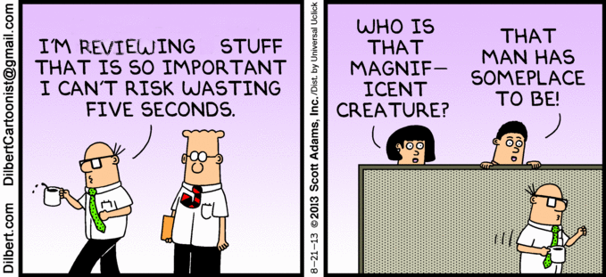

# Pull request etiquette

What exactly should one expect when requesting or reviewing a pull request?

As a requester:

 - [Request a review](pr-request.md) to the code owner of the tool, not a team. This should happen automatically when [code owners](https://help.github.com/en/articles/about-code-owners) are set up for the repository.
 - Reach out within the pull request or preferably face to face with the reviewers to communicate the urgency and get an estimated time to review. Most teams have a daily standup. Why not join them after that time?
 - Be specific about what you're asking from the reviewer: are you asking for a code review or to test your pull request?

As a reviewer:

 - When you receive a pull request review and are unable to finish it within a reasonable time, you are responsible to inform that you are unable to review in a timely manner. If needed, suggest another reviewer and mention that person in the pull request to keep the process from being blocked.

When the code is reviewed and the tests pass, [signing off](../..[ublish/sign-off.md) of the "merge and deploy" is only a formality. At this stage the pull request should not require any additional work from the person signing off nor from the developers.
